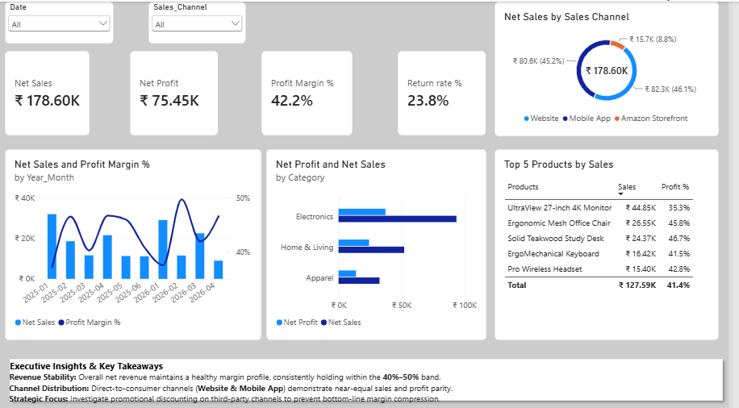
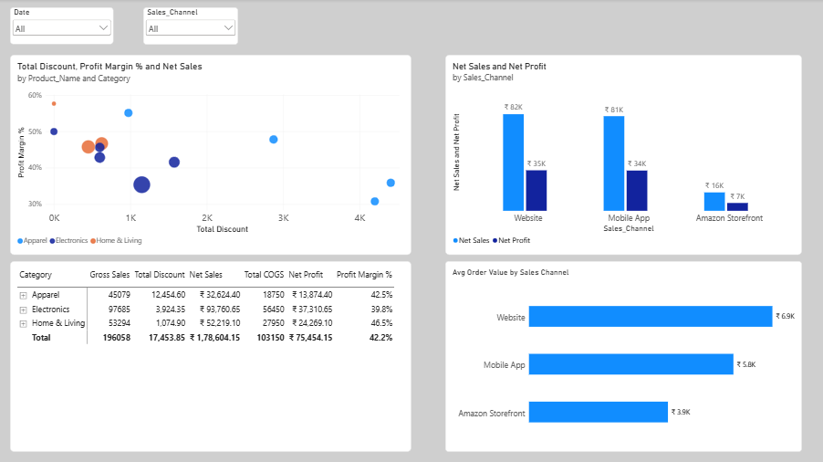
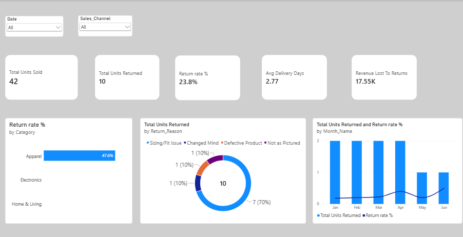

# Omnichannel Retail Analytics & Profitability Dashboard (Power BI)

A 3-page Power BI reporting suite analyzing sales performance, margin health, channel profitability, and return root causes across Website, Mobile App, and Amazon Storefront.

## Repository Structure

```text
├── Omnichannel_retail_dashboard.pbix   # Main Power BI Desktop file
├── README.md                           # Project documentation and analysis breakdown
├── page1_Overview.png                  # Executive overview dashboard visual
├── page2_deep_dive.png                 # Category and channel diagnostic visual
└── page3_logistics.png                 # Logistics and returns breakdown visual
```

## Project Overview

In this project, I worked with omnichannel retail transaction data to solve three practical operational and commercial questions:

1. **Margin Dilution:** Overall sales looked strong, but margins in certain categories were dropping due to inconsistent discounting.
2. **Channel Performance Gap:** Amazon sales were lagging behind DTC channels (Website & Mobile App). I analysed channel-level Average Order Value (AOV) to understand whether the gap was driven by demand or basket size.
3. **Return Spike:** Product return rate reached **23.8%**. The operations team needed to verify if delivery delays were causing cancellations/returns, or if product-level defects were responsible.

---

## Dashboard Walkthrough

### Page 1: Executive Overview
A high-level summary view designed for business stakeholders to track daily operations and financial trajectory.
* **Key KPIs:** Net Sales (₹178.60K), Net Profit (₹75.45K), Profit Margin (42.2%), and Return Rate (23.8%).
* **Visuals:** Monthly revenue & profit margin trends, sales share by channel, top 5 revenue-generating products, and key business takeaway notes.



---

### Page 2: Category & Channel Deep-Dive
A diagnostic page built to identify which products and channels drive profitability versus margin leakage.
* **Financial Waterfall Matrix:** Breaks down Gross Sales -> Discounts -> Net Sales -> COGS -> Net Profit -> Margin % by category.
* **Discount vs Margin Scatter Plot:** Flags over-discounted items that fall below target margin thresholds.
* **AOV by Sales Channel:** Highlights basket size variation across channels (Website at ₹6.86K, Mobile App at ₹5.76K, and Amazon at ₹3.92K).



---

### Page 3: Logistics & Returns Analysis
Focuses on reverse logistics and post-purchase customer experience.
* **Delivery Performance:** Average delivery turnaround is **2.77 days**, confirming fast logistics across delivery hubs and ruling out shipping delays as the cause of returns.
* **Return Reasons:** **70% of total returns** are caused by **Sizing/Fit Issues** in the Apparel category, driving **₹17.55K** in returned value.
* **Trend Over Time:** Tracks return quantities by month to monitor seasonal return volume.



---

## Data Model & Architecture

The report is built on a clean **Star Schema** to ensure fast query performance and reliable filter propagation:

* **Fact Tables:** 
  * `fact_orders` (transactions, unit prices, discounts, quantities)
  * `fact_returns` (return dates, returned quantities, return reasons, restocking fees)
* **Dimension Tables:** 
  * `dimProducts` (SKUs, categories, unit costs, retail prices)
  * `dim_customers` (customer segments)
  * `dim_geography` (cities, regions, delivery hubs)
  * `dim_date` (calendar master)

### Data Modeling Challenge: Relationship Ambiguity
Connecting `dim_date` to both `fact_orders` and `fact_returns` created multiple active paths back to `dimProducts`, triggering a circular dependency error in Power BI.

To fix this:
* Kept the primary relationship between `dim_date` and `fact_orders` active.
* Set the relationship between `dim_date[Date]` and `fact_returns[Return_Date]` as **Inactive**.
* Activated the inactive path dynamically inside DAX measures using `USERELATIONSHIP`:

```dax
Total Units Returned = 
CALCULATE(
    SUM('fact_returns'[Returned_Quantity]),
    USERELATIONSHIP('dim_date'[Date], 'fact_returns'[Return_Date])
)
```
